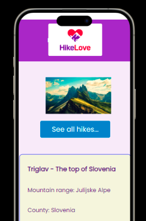

# Hikelove

Hikelove is a simple web application, created using React.



## Table of Contents

- [Introduction](#introduction)
- [Features](#features)
- [Technologies](#technologies)
- [Deployment](#deployment)
- [APIs used](#apis-used)
- [Local Development](#local-development)


## Introduction

The main objectives were to use React, a mock backend and to create a web application with CRUD functionalities.

- [presentation slides](https://docs.google.com/presentation/d/1F-kHrW5AczjasIT3nruo4KDeuP5JtwIp3Yiv9CvE-k4/edit#slide=id.g1f88252dc4_0_1535)

## Features

- CRUD functions for reviews - some reviews are pre-rendered from the mock backened. However, it is also possible to add a review, edit it and delete it.
- image carousel - credits go to Aaakash Jha [(https://blog.bitsrc.io/simple-carousel-in-react-2aac73887243)]
- integration with AccuWeather API and OpenStreetMap API

## Technologies

- React
- JavaScript (ES6)
- HTML/CSS
- Vite
- Axios
- Node.js and npm
- Git and GitHub
- Adaptable
- React Router
- JSX
- Babel
- ESLint
- Prettier


## Deployment

Deployed on GitHub Pages -->
[click here](https://pikkukurkku.github.io/react_project/#/)

The API (json server) is deployed on Adaptable -->
[click here](https://json-server.adaptable.app/)

## APIs used
[AccuWeater APIs](https://developer.accuweather.com/)

[OpenStreetMap/Leaflet](https://leafletjs.com/)

## Local Development

To set up the project locally for development purposes:

```bash
# Installation
npm install

# Run the development server
npm run dev